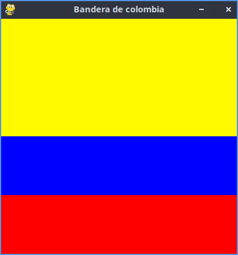

# Estructura de un juego en Pygame

## Inicializacion

- Como en todo programa en Python, se deben importar los modulos o librerias a utilizar.
`import pygame`

- Lo siguiente que se hace es inicializar Pygame usando la funcion init(). Inicializa todos los modulos de pygame importados.
`pygame.init()`

## Visualizacion de la ventana

`ventana = pygame.display.set_mode((600,400))`
- Set_mode es la funcion encargada de definir el tamaño de la ventana. En el ejemplo se esta definiendo una ventana de 600 px de ancho por 400 px de alto.

`pygame.display.set_caption("Mi ventana)`

- Set_caption() es la funcion que añade un titulo a la ventana.

### Funcion set_mode()

`set-mode(size =(0,0), flags = 0, depht = 0, display = 0)`

- size = (600,400) : define el tamañode la ventana.
- flags : Define uno o mas comportamientos para la ventana.
    - Valores:
        - pygame.FULLSCREEN
        - Pygame.RESIZABLE
    - Ejemplo
        - flags = pygame.FULLSCREEN  pygame.RESIZABLE: pantalla completa. Dimensiones modificales.

## Bucle del juego -game loop
- Bucle infinito que se interrumpira al cumplir ciertos criterios.
- Reloj interno del juego.
- En cada iteracion del bucle del juego podemos mover a un personaje, como tener en cuenta que un objeto ha alcanzado ha otro, o que se ha cruzado la linea de llegada lo que quiere decir que la partida a terminado.
- Cada iteracion es una oportunidad para actualizar todos los datos relacionados con el estado actual de la partida en cada iteracion se realizan las siguientes tareas:
     1. Comprobar que no se alcanzan las condiciones de parar, en cuyo caso se interrumpe el bucle. 
     2. Actualizar los recursos necesarios para la iteracion actual.
     3. Obtener las entradas del sistema, o de interaccion con el jugador.
     4. Actualizar todas las entidades que caracterizan el juego.
     5. Refrescar la pantalla.

     ### Superficies Pygame
     - Superficie:
          - Elemto geometrico.
          - Linea, poligono, imagen, texto, quien se muestra en la pantalla.
          - El poligono se puede o no rellenar de color.
          - La superficies se crean de diferente manera dependiendo del tipo: 
              - Imagen: `image.load()` 
              - Texto: `font.render()`
              - Superficie generica: `Pygame.Surface()`
              - Ventana del juego: `Pygame.display.set_mode()
             `
 # Ejemplo de Banderade Colombia

``` # selecionar un color
amarillo = (255,250,0)
azul = (0,0,255)
rojo = (255,0,0)
superficie_aleatoria = pygame.Surface((300, 300))

# creamos una superficie
amarillo_Superficie = pygame.Surface((400,200))
azul_Superficie = pygame.Surface((400,100))
rojo_Superficie = pygame.Surface((400,100))

# Rellenamos la superficie de azul
amarillo_Superficie.fill(amarillo)
azul_Superficie.fill(azul)
rojo_Superficie.fill(rojo)


# Inserto o muevo la superficie en la ventana
ventana.blit(amarillo_Superficie, (0, 0))
ventana.blit(azul_Superficie, (0, 200))
ventana.blit(rojo_Superficie, (0, 300))
```

